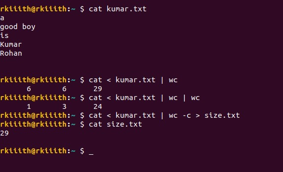

# OSN ASSIGNMENT 2

## Linux Terminal in C
 

### 1. Display :

</img>

### 2. Builtin Commands:
<ol>
<li>cd</li>
	Commands handled:
<ul>
<li>cd</li>
<li>cd ..</li>
<li>cd folder_name</li>
<li>cd ~</li>
<li>cd ~/folder_name</li>
<li>cd ./folder_name</li>
<li>cd ../folder_name</li>
<li>cd absolute path</li>
</ul>
 
<li>pwd</li>
Commands handled:
<ul>
<li>pwd</li>
</ul>
 
<li>echo</li>
Commands handled:
<ul>
<li>echo ...</li>
<li> ... => ALL POSSIBLE SENTENCES WITH TABS/SPACES</li>
</ul>
</ol>

### 3. ls Command :
<h3>ls</h3>
	Commands handled:
<ul>
<li>ls FLAGS</li>
<li>ls .. FLAGS</li>
<li>ls . FLAGS</li>
<li>ls ~/folder_name  FLAGS</li>
<li>ls DIRECTORY-1 DIRECTORY-2</li>
<li>ls File_name</li>
<li>ls ../folder_name</li>
</ul>

FLAGS : -a/-l/-la/-al are handled.  And the ordering does'nt matter of the files and flags in the command.

### 4. System commands with/without Arguments

1. Foreground processes
 
</img>
2. Background processes
 
</img>

The combination of both is also handed :).

### 5. pinfo Command

<h3>pinfo</h3>
Commands handled:
<ul>
<li>pinfo</li>
<li>pinfo PROCCESS_ID</li>
</ul>

</img>

### 6. Finished Background Proccess

<h3>Background proccess handler</h3>
Commands handled:
<ul>
<li>All commands with & after them</li>
</ul>

</img>

### 7. Discover Command :
<h3>discover</h3>
	Commands handled:
<ul>
<li>discover FLAGS</li>
<li>discover .. FLAGS</li>
<li>discover . FLAGS</li>
<li>discover ~/folder_name  FLAGS</li>
<li>discover DIRECTORY "file_name"</li>
<li>discover "File_name"</li>
<li>discover ../folder_name "file_name" FLAGS</li>
</ul>

FLAGS : -d/-f are handled.  And the ordering does'nt matter of the files and flags in the command.

### 8. History
<h3>history</h3>
</img> 

It gives the latest 10 instructions .  It stores latest 20 instructions in a file named "history.txt" in running folder.

My code is <b>Modular</b> in terms that i have made seperate functions for all the builting/fg/bg commands but all these functions exist in a single file 
  named as <b>TerminalinC.c</b> .

### 9. I/O Redirection
<h3>I/O Redirection</h3>
</img> 

Output : > Input : < Append : >> .
  It can handle multiple < , > and >> combinations.
 

### 10. PIPES
<h3>PIPES</h3>
Contains both specification 2 and 3 of assignment 3.
</img> 

  It can handle multiple pipes with I/O redirection. (In the starting command and the end command).